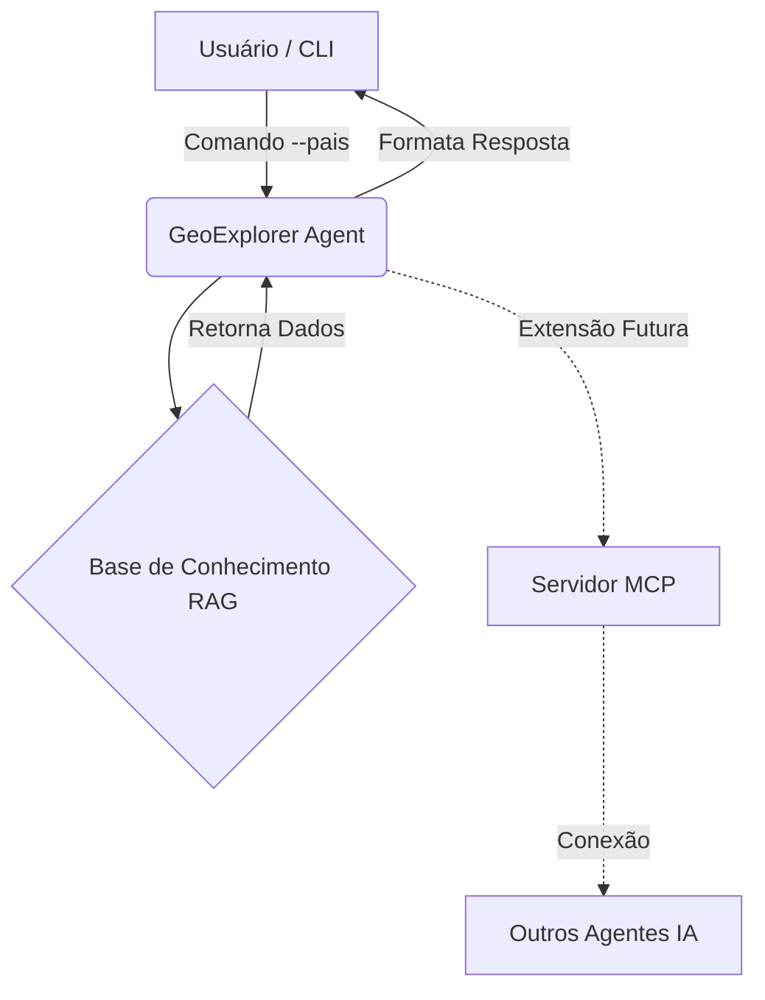

# Geo-Explorer IA 🌍

## O que é o Geo-Explorer
O **Geo-Explorer** é um agente construído em Python que simula um assistente de inteligência artificial focado em exploração e conhecimentos geográficos. Ele serve como base para ser estendido em um Servidor MCP, permitindo que ferramentas e outros modelos consumam dados estruturados sobre continentes, países e capitais.

## Arquitetura e Integração (Mermaid)


## Como usar os comandos
A interação atual com o agente é feita via CLI (Command Line Interface). 

### Exemplo de Uso:
```bash
python geo_explorer.py --pais "Brasil"
```
**Retorno Esperado:**
`[Agente Geo-Explorer]: A capital de Brasil é Brasília e fica no continente América do Sul.`

| Comando CLI | Descrição | Exemplo |
|---|---|---|
| `--pais` | Argumento para consultar dados de um país | `python geo_explorer.py --pais japao` |

## Como executar os testes
O projeto foi desenvolvido focando em qualidade e robustez. Para rodar a suíte de testes unitários:
```bash
python -m unittest test_geo_explorer.py
```

## O que eu aprendi durante o desafio e Melhorias
- **Aprendizado:** Consolidar a visão de como um Agente atua como intermediário entre a base de dados (ferramenta) e o usuário final. Entender a fundação de um Servidor MCP e como ele pode plugar nesse código Python de maneira modular.
- **Melhorias Realizadas:** Implementei tratamento para consultas *case-insensitive* e construí uma suíte de testes unitários para evitar regressões, além da documentação estruturada da arquitetura com o Mermaid.

## Autor
**Wendel Vieira**
